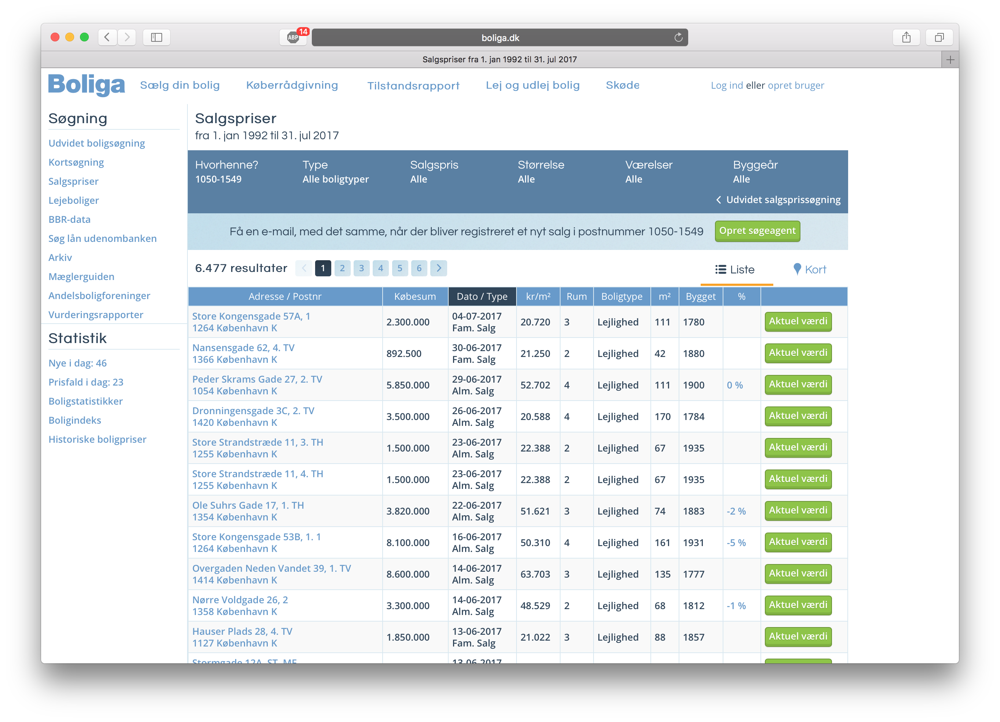

# Assignment 2: Data Collection

Your task is to scrape a complete dataset of historical Danish housing sales data.

The data comes originally from http://www.boliga.dk/salg. To get an impression of the data, point your browser to that page and select for example `1050-1049 København K` as `Postnr:` and `1992` as `Vejnavn:` (just keep `Boligtype:` and `Fra:` field with their default values). After hitting the green `Søg` button, you will be directed to a page with the following URL http://www.boliga.dk/salg/resultater?so=1&sort=omregnings_dato-d&maxsaledate=today&iPostnr=1050-1549&gade=&type=&minsaledate=1992  and that looks similar to the following:


On that page you will find a paginated list with 40 entries per page and in total more than 6400 historical housing sales records for Copenhagen's city center.

To scrape the complete dataset, you have to store all Danish housing sales records from 1992 to now.


## Task
  1. Scrape a complete dataset of historical Danish housing sales data from http://138.197.184.35/boliga. _**Do not**_ scrape directly from http://www.boliga.dk as this might put a too high load on their servers and as they might block your IP.
  2. Save your scraped results in one CSV file per zip code area. Each CSV file has a header like:
  
  ```
  address,zip_code,price,sell_date,sell_type,price_per_sq_m,no_rooms,housing_type,size_in_sq_m,year_of_construction,price_change_in_pct
  ```

  where each column corresponds to the header of the tables in the HTML pages 

  ```
  _Adresse / Postnr | Købesum | Dato / Type | kr/m² | Rum | Boligtype | m² | Bygget | %_
  ```

  Furthermore, each row in a table of an HTML page becomes a row in a corresponding CSV file.

  3. Count the amount of scraped housing data sales records from your CSV files.
    - How many sales records are there per zip code area?
    - How many sales records are there in total?
  4. Provide some more statistics, with the help of Bash commands.
    - For which zip code area do you have the most sales records?
      * How many sales records?
      * How big is the corresponding CSV file in kilobytes?
    - For which zip code area do you have the fewest sales records?
      * How many sales records?
      * How big is the corresponding CSV file in megabytes?


## Hand-in Procedure

  * Provide all code, documentation, and solution text for this assignment in a repository on Github.
  * Create a release of your project on Github, see https://help.github.com/articles/creating-releases/
  * Create a Markdown (.md) file called `README.md` in the root of your project.
    - That `README.md` contains a first section with your solutions to tasks 3. and 4.
    - It contains a second section woth documentation on how to setup and run your webscraper to replicate your results.
  * Hand-in a link to the **release** on Moodle, see https://help.github.com/articles/linking-to-releases/
  * Hand-in at latest on Sunday 17th Sept. 2017 at 23:59. You will upload a link to the **release** on Moodle (one link per group).


## Hints

  1. **OBS:** _**Do not**_ scrape directly from http://www.boliga.dk as this might put a too high load on their servers and as they might block your IP. Instead scrape the data from a mirror http://138.197.184.35/boliga. On that mirror you will find an HTML pages that have a name like `<ZIP_NUMBER>_<PAGE_INDEX>.html` for example `http://138.197.184.35/boliga/4000_2.html` or `http://138.197.184.35/boliga/1050-1049_1.html`.
  2. Make your scraper robust, so that it does not crash in case of unexpectet values in a sales record.
  3. In case you saved your scraped data in a CSV file per ZIP code, you can count the lines per file and receive a total line count with the help of the `find` and `xargs` commands, e.g., `$ find . -name '*.csv' | xargs wc -l`. Otherwise, in case you have a single CSV file you can count the lines directly via `$ cat boliga_all.csv | wc -l`.
  In the former case you should get counts similar to the following:
  ```bash
  $ find . -name '*.csv' | xargs wc -l
      233 ./boliga_1050-1549.csv
      714 ./boliga_1550-1799.csv
      923 ./boliga_1800-1999.csv
      744 ./boliga_2000.csv
      310 ./boliga_2100.csv
      700 ./boliga_2150.csv
  ...
      741 ./boliga_9981.csv
      404 ./boliga_9982.csv
      258 ./boliga_9990.csv
   5901 total
   ```
   4. Keep the data, which you scraped in CSV format. We will use it in the remainder of this course!
   5. In case your scraper crashes after some time because it eats up all memory, you might consider a Bash script, which wraps your Python scraper and which calls it with an argument per zip code area. That will create a new process for each zip code area and it will guarantee that there is sufficient free memory for your scraper to work.